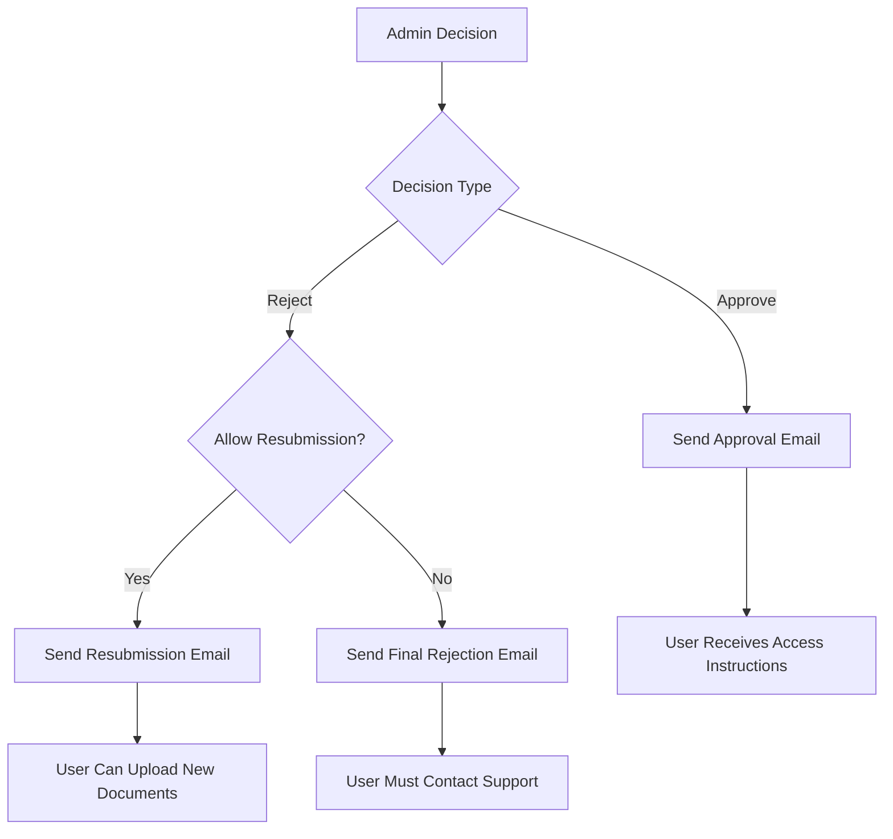

# Email Notifications and Document Resubmission System

This document outlines the implementation of email notifications for verification decisions and the document resubmission functionality.

## Features Implemented

### 1. Email Notification System

**Components:**
- `email-templates.ts` - Professional HTML email templates
- `email-service.ts` - Email sending functionality with nodemailer
- Automatic email notifications on approval/rejection

**Email Types:**
- **Verification Approved**: Congratulatory email with account access instructions
- **Verification Rejected**: Professional rejection email with resubmission options

**Email Features:**
- **HTML Templates**: Professional, responsive email designs
- **Plain Text Fallback**: Accessible text-only versions
- **Personalization**: Uses user's first name and email
- **Call-to-Action Buttons**: Direct links to platform access
- **Detailed Instructions**: Clear next steps for users

### 2. Document Resubmission System

**New Verification Status:**
- `resubmission_required` - User can upload new documents without re-signing contract

**Key Features:**
- **Contract Preservation**: Users keep their existing contract signature
- **Selective Rejection**: Admins can choose between permanent rejection or resubmission
- **Automatic Routing**: Resubmitted documents go directly to review
- **Audit Trail**: Tracks resubmission count and history

**User Experience:**
- Clear resubmission messaging in dashboard
- Visual indicators for resubmission status
- Explanation that contract signature remains valid
- Direct upload link for new documents

### 3. Enhanced Admin Interface

**New Admin Capabilities:**
- **Resubmission Toggle**: Option to allow document resubmission
- **Email Preview**: Shows what email will be sent
- **Enhanced Status Tracking**: New resubmission_required status
- **Improved Review Flow**: Handles both new and resubmitted documents

## Technical Implementation

### Database Schema Updates

```javascript
// User Model Updates
verificationStatus: {
  enum: ['pending', 'documents_uploaded', 'contract_signed', 'verified', 'rejected', 'resubmission_required']
}

passportDocument: {
  filename: String,
  url: String, // Enhanced for document preview
  uploadedAt: Date,
  status: String,
  rejectionReason: String,
  resubmissionCount: Number, // Track resubmission attempts
  allowResubmission: Boolean // Admin-controlled resubmission permission
}

contractSigned: {
  signedAt: Date,
  ipAddress: String,
  userAgent: String,
  signatureData: String, // Base64 encoded signature
  signatureMethod: String // 'digital_signature' or 'checkbox'
}
```

### API Endpoints Enhanced

**Enhanced Endpoints:**
- `PUT /api/admin/verification/[id]` - Now includes email notifications and resubmission
- `POST /api/verification/upload-document` - Handles resubmission flow
- `GET /api/verification/document/[token]` - Enhanced with legacy URL support

**New Request Format:**
```javascript
// Verification Decision API
{
  status: 'verified' | 'rejected',
  rejectionReason?: string,
  allowResubmission?: boolean // New field for resubmission control
}
```

### Email Configuration

**Environment Variables:**
```env
SMTP_HOST=smtp.gmail.com
SMTP_PORT=587
SMTP_USER=your-email@example.com
SMTP_PASS=your-app-password
SMTP_FROM=noreply@mpu-focus.com
```

**Supported Email Providers:**
- Gmail (recommended for development)
- Outlook/Hotmail
- Custom SMTP servers
- SendGrid, Mailgun (with appropriate SMTP settings)

## User Workflows

### 1. Normal Verification Flow

1. **Document Upload** → Documents uploaded
2. **Contract Signing** → Contract signed
3. **Admin Review** → 
   - **Approved** → Email sent, user verified
   - **Rejected (Final)** → Rejection email sent
   - **Rejected (Resubmission)** → Resubmission email sent

### 2. Resubmission Flow

1. **Initial Rejection** → Admin selects "Allow resubmission"
2. **Email Notification** → User receives resubmission instructions
3. **Document Reupload** → User uploads new documents via dashboard
4. **Skip Contract** → Previous signature remains valid
5. **Direct Review** → Goes straight to admin review
6. **Final Decision** → Approved or permanently rejected

### 3. Email Notification Flow



## Admin Interface Updates

### New Review Options

**Rejection Form Enhancements:**
- **Rejection Reason**: Required detailed explanation
- **Resubmission Checkbox**: "Allow document re-submission"
- **Visual Indicators**: Shows impact of each option
- **Email Preview**: Explains what email will be sent

**Status Management:**
- **New Status Filter**: "Resubmission Required"
- **Enhanced Status Badges**: Orange badge for resubmission required
- **Resubmission Counter**: Shows how many times documents were resubmitted

### Visual Indicators

```css
/* Status Colors */
.resubmission-required {
  background: #fed7aa; /* Orange-100 */
  color: #c2410c;      /* Orange-800 */
}
```

## Email Templates

### Approval Email Features
- **Congratulatory Design**: Celebration theme with success colors
- **Feature Highlights**: Lists what user can now access
- **Call-to-Action**: Prominent "Access Your Account" button
- **Next Steps**: Guidance for getting started

### Rejection Email Features
- **Professional Tone**: Respectful and helpful messaging
- **Clear Requirements**: Detailed document requirements
- **Resubmission Instructions**: Step-by-step process when applicable
- **Support Information**: Contact details for assistance

## Document Preview Enhancements

### Legacy Document Support
- **Automatic URL Construction**: Builds UploadThing URLs from filenames
- **Backward Compatibility**: Supports documents uploaded before URL storage
- **Error Handling**: Graceful fallback for missing documents

**URL Construction Logic:**
```javascript
// For legacy documents without stored URLs
const documentUrl = user.passportDocument.url || 
  `https://utfs.io/f/${user.passportDocument.filename}`
```

## Security and Compliance

### Email Security
- **SMTP Authentication**: Secure email transmission
- **Template Validation**: XSS prevention in email content
- **Rate Limiting**: Prevents email spam (recommended to implement)

### Data Protection
- **Audit Trail**: Complete tracking of all verification decisions
- **Secure Storage**: Email logs and notification history
- **GDPR Compliance**: User consent and data handling

### Resubmission Security
- **Token Validation**: Ensures legitimate resubmission requests
- **Status Verification**: Prevents unauthorized document uploads
- **Contract Integrity**: Preserves original signature data

## Configuration and Setup

### 1. Email Provider Setup

**Gmail Configuration:**
1. Enable 2-factor authentication
2. Generate app-specific password
3. Use app password in SMTP_PASS

**Environment Variables:**
```env
SMTP_HOST=smtp.gmail.com
SMTP_PORT=587
SMTP_USER=your-gmail@gmail.com
SMTP_PASS=your-16-character-app-password
SMTP_FROM=MPU-Focus Team <noreply@mpu-focus.com>
```

### 2. Testing Email Configuration

```javascript
// Test email configuration
import { testEmailConfiguration } from '@/lib/email-service'

const isConfigValid = await testEmailConfiguration()
console.log('Email config valid:', isConfigValid)
```

### 3. Monitoring and Logging

**Email Logging:**
- Success/failure tracking in console logs
- Email delivery status monitoring
- Error handling and fallback procedures

## Best Practices

### 1. Email Content
- **Clear Subject Lines**: Descriptive and professional
- **Mobile Responsive**: Emails work on all devices
- **Actionable Content**: Clear next steps for users
- **Brand Consistency**: Matches platform design

### 2. Resubmission Management
- **Clear Communication**: Explain exactly what needs to be updated
- **Reasonable Limits**: Consider limiting resubmission attempts
- **Quick Turnaround**: Fast admin review for resubmitted documents

### 3. User Experience
- **Status Transparency**: Users always know where they stand
- **Progress Indicators**: Clear verification progress
- **Support Access**: Easy contact for help

## Troubleshooting

### Common Email Issues
1. **SMTP Authentication Failed**: Check credentials and 2FA setup
2. **Emails Not Delivered**: Verify SMTP settings and DNS
3. **HTML Rendering Issues**: Test across email clients

### Resubmission Issues
1. **Documents Not Uploading**: Check file permissions and token validity
2. **Wrong Status**: Verify admin set allowResubmission flag
3. **Contract Re-signing**: Ensure resubmission logic preserves contract

### Legacy Document Issues
1. **Preview Not Working**: Verify UploadThing URL construction
2. **Missing Files**: Check UploadThing storage and filename accuracy
3. **Access Denied**: Verify UploadThing permissions and file existence

## Future Enhancements

### Planned Improvements
- **Email Analytics**: Track open rates and click-through rates
- **Template Customization**: Admin-configurable email templates
- **Bulk Actions**: Mass approval/rejection with notifications
- **SMS Notifications**: Optional SMS alerts for important updates
- **Advanced Resubmission**: Time limits and attempt restrictions

This implementation provides a complete notification and resubmission system that enhances the verification process while maintaining security and user experience standards.