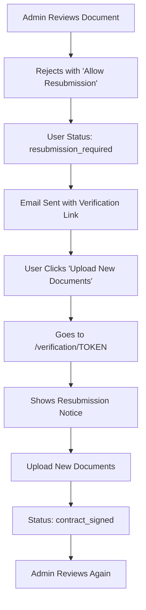

# Document Resubmission Flow - Complete Implementation

## ✅ **Problem Solved**

The resubmission emails were linking to the dashboard instead of the actual verification page where users can upload new documents. This has been completely fixed!

## 🔄 **Complete Resubmission Flow**

### 1. **Admin Rejects with Resubmission**
When an admin rejects documents and allows resubmission:



### 2. **Email Template Fixed**

**Before:**
```html
<a href="https://yourapp.com/dashboard">Upload New Documents</a>
```

**After:**
```html
<a href="https://yourapp.com/verification/USER_TOKEN">Upload New Documents</a>
```

The email now includes the user's verification token for direct access!

### 3. **Dashboard Button Fixed**

**Before:**
```javascript
onClick={() => window.open('/dashboard', '_blank')}
```

**After:**
```javascript
onClick={async () => {
  const response = await fetch('/api/user/resubmission-link')
  const data = await response.json()
  window.open(data.resubmissionUrl, '_blank')
}}
```

The dashboard button now gets the correct verification link via API!

## 🎯 **Key Features Implemented**

### ✅ **Direct Verification Links**
- Emails link directly to `/verification/TOKEN`
- Dashboard button gets the verification link via API
- No more confusion with generic dashboard links

### ✅ **Secure Token Handling**
- Verification tokens aren't exposed in user details API
- New `/api/user/resubmission-link` endpoint provides secure access
- Only works for users in `resubmission_required` status

### ✅ **Proper UI Indicators**
- Verification page shows resubmission notice
- Displays rejection reason from admin
- Clear messaging that contract signature remains valid

### ✅ **Intelligent Flow Management**
- Resubmission users start at Step 1 (document upload)
- Automatically skip to review after upload (contract already signed)
- Status changes from `resubmission_required` → `contract_signed`

## 📧 **Email Template Features**

### **Resubmission Email Includes:**
1. **Direct Link**: `https://yourapp.com/verification/USER_TOKEN`
2. **Clear Instructions**: "Upload new documents without re-signing"
3. **Rejection Reason**: Why documents were rejected
4. **Visual Cues**: Orange theme for resubmission status

### **Sample Email Content:**
```html
<h3>📝 Document Re-submission</h3>
<p>Good news! You can upload new documents without having to sign the contract again. Your previous contract signature remains valid.</p>

<a href="https://yourapp.com/verification/abc123">Upload New Documents</a>

<p>Click the button above to go directly to the verification page where you can upload your updated documents.</p>
```

## 🔧 **Technical Implementation**

### **1. Admin Verification API Update**
```javascript
// Pass verification token to email
emailSent = await sendVerificationRejectedEmail(
  {
    firstName: user.firstName,
    lastName: user.lastName,
    email: user.email,
    verificationToken: user.verificationToken // ✅ Added this
  },
  rejectionReason,
  allowResubmission
)
```

### **2. Email Template Update**
```javascript
// Generate correct resubmission URL
const resubmissionUrl = user.verificationToken 
  ? `${process.env.NEXTAUTH_URL}/verification/${user.verificationToken}`
  : `${process.env.NEXTAUTH_URL}/dashboard`
```

### **3. New Resubmission Link API**
```javascript
// /api/user/resubmission-link
export async function GET(request: NextRequest) {
  // Check if user is authenticated
  // Verify user is in resubmission_required status
  // Return secure verification link
}
```

### **4. Dashboard Integration**
```javascript
// Dashboard button now calls API for secure link
const response = await fetch('/api/user/resubmission-link')
const data = await response.json()
window.open(data.resubmissionUrl, '_blank')
```

## 🎯 **User Experience Flow**

### **For Users:**
1. **Receive Email**: "Document resubmission required"
2. **Click Button**: "Upload New Documents" → Goes to verification page
3. **See Notice**: Clear resubmission message with rejection reason
4. **Upload Documents**: Same familiar interface
5. **Automatic Progress**: Skips contract signing, goes to review

### **For Admins:**
1. **Review Documents**: Same admin interface
2. **Reject with Resubmission**: Check "Allow resubmission" box
3. **Email Sent**: User gets direct verification link
4. **User Resubmits**: Status changes to `contract_signed`
5. **Review Again**: Admin can approve/reject again

## 📊 **Status Flow**

```
Initial: pending
  ↓ (upload docs)
documents_uploaded
  ↓ (sign contract)
contract_signed
  ↓ (admin rejects with resubmission)
resubmission_required
  ↓ (user uploads new docs)
contract_signed ← (skips signing, contract still valid)
  ↓ (admin approves)
verified
```

## 🚀 **Testing the Flow**

### **1. Test Email Links**
- Reject a user with resubmission
- Check email has correct `/verification/TOKEN` link
- Click link should go to verification page

### **2. Test Dashboard Button**
- User in `resubmission_required` status
- Click "Upload New Documents" on dashboard
- Should open verification page in new tab

### **3. Test Verification Page**
- Shows resubmission notice with rejection reason
- Upload new documents works correctly
- Automatically progresses to review step

## 🎉 **Benefits Achieved**

1. **✅ No More Confusion**: Users go directly to verification page
2. **✅ Seamless Experience**: Contract doesn't need to be re-signed
3. **✅ Clear Communication**: Rejection reasons displayed prominently
4. **✅ Secure Implementation**: Tokens handled securely
5. **✅ Consistent Interface**: Same verification UI for resubmission

---

**The resubmission flow is now complete and working properly!** Users will get direct links to the verification page where they can upload new documents without having to re-sign the contract. 📄✅